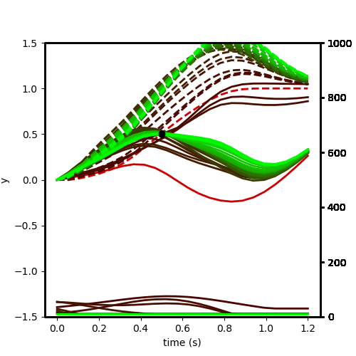
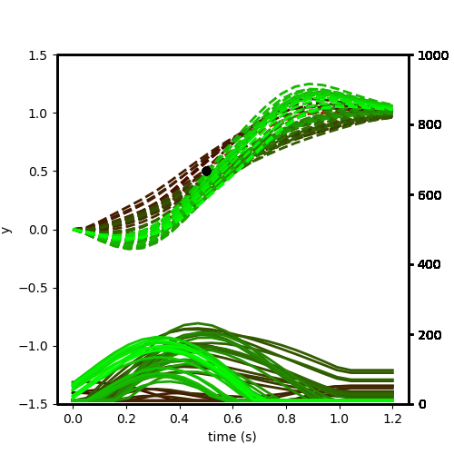

# Optimization of gains in (stochastic) force fields

With DmpWithSchedules, it is possible to learn variable gain schedules, as was first published in the paper "Learning variable impedance control", J Buchli, F Stulp, E Theodorou, S Schaal, in the International Journal of Robotics Research, 2011.

This demo implements an experiment similar to the one presented in the paper "Reinforcement learning of impedance control in stochastic force fields", F Stulp, J Buchli, A Ellmer, M Mistry, E Theodorou, S Schaal, IEEE International Conference on Development and Learning, 2011. The explanation in this README will be much easier to follow after having read that paper.

The aim of the task (implemented in TaskViapointWithGains) is to pass through a 1D viapoint at t=0.5, and minimize the gains that are used. When executing the DMP that is being optimized (implemented in TaskSolverDmpWithGainsAndForceField), a force field is applied to the DMP. it is close to 0 at the beginning and end of the movement, and has its maximum force at t=0.5 (it is a Gaussian function). When executing the DMP, a PD controller is used to track the reference trajectory. A higher P-gain leads to more accurate tracking. The schedule for the P-gain is encoded in the schedule of the DmpWithSchedules. 

With a constant force field, the results are typically as in the figure below. In the second graph, initially the reference trajectory (red, dashed) goes below the viapoint. The Gaussian-shaped force field, which pushes downwards, makes the initial actual trajectory (red, solid) go even further away from the viapoint (the Gaussian shape is recognizable). After 100 updates, the reference trajectory generated by the DMP (brigh green, dashed) lies above the viapoint. When the force field is applied to this reference trajectory, it pushes the actual trajectory to go through the viapoint. This is possible because the force field is the same each time, and can thus be "predicted" by the optimized DMP. If the force field would be turned off suddenly, the actual trajectory would be equivalent to the reference trajectory, and overshoot the viapoint. This is known in biophysics as an "after effect". Note that not much is happening with the gains (plotted at the bottom), apart from decreasing somewhat during learning, i.e. from an initial value of 200 to 150-180 (see right y-axis). Please ignore the legend in this graph; that was a bug.

In a stochastic force field, the force field is different during each trial (uniformly sampled from a range). Sometimes it is pushing up, sometimes down. Sometimes it is strong, sometimes it is weak. This cannot be compensated for by "overshooting" the reference trajectory, as for the constant force field. Instead, after learning, the reference trajectory (bright green, dashed) goes through the viapoint. The gains however go up substantially before reaching the viapoint (solid lines). This is to compensate for the unpredictable perturbations due to the stochastic force field; higher gains lead to stricter tracking of the reference trajectory. Note that the actual trajectory is not plotted here; it is different every time because the force field is stochastic, and these trajectories only clutter the image. Because there is no reward for good tracking after having passed through the viapoint, the gains go down substantially after the viapoint at t=0.5; even lower than they were initially (see the red solid line with an initial gain of 200).

